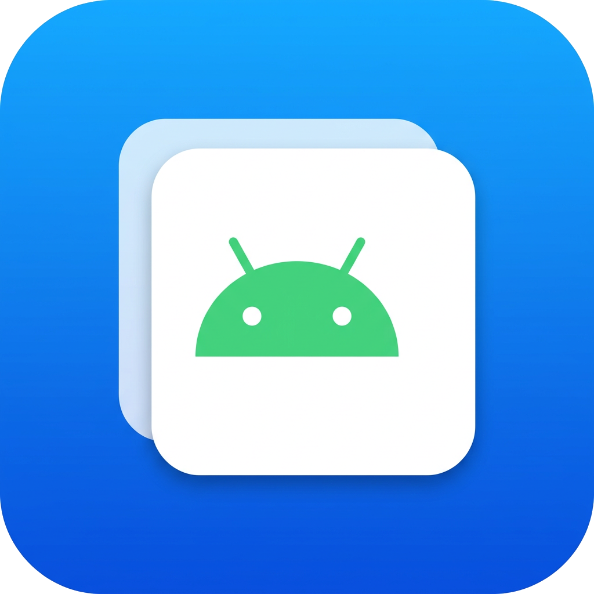

# ClonApk

Pembuat salinan (clone) aplikasi Android dengan antarmuka bergaya iOS.

## ⬇️ Unduh APK (publik)

**[ClonApk.apk](https://github.com/wiwoktokkkkk/clonapk/releases/latest/download/ClonApk.apk)**
— build release terbaru, tanpa perlu akun GitHub.

Halaman rilis: https://github.com/wiwoktokkkkk/clonapk/releases

Cara pakai: ketuk **Clone** pada aplikasi mana pun — package baru dibuat
otomatis dan installer terbuka sendiri. Clone memakai nama & ikon yang sama
dengan aplikasi aslinya, dan bisa dibuka dari seksi **Clone kamu**.

ClonApk mengambil sebuah APK, mengganti identitasnya (applicationId, otoritas
provider, permission kustom, referensi kelas) sehingga salinannya bisa dipasang
**berdampingan** dengan aplikasi aslinya, lalu menandatangani ulang salinan itu
dengan kunci yang dibuat aplikasi. UI-nya memakai widget Cupertino penuh —
daftar inset bergrup, lembar bawah, animasi, dan tipografi — supaya terasa
seperti aplikasi iOS di atas Android.



## Fitur

- Daftar aplikasi terpasang (dengan pencarian dan opsi aplikasi sistem) untuk
  dipilih sebagai sumber clone.
- Memilih berkas APK dari penyimpanan bila APK tidak terdaftar.
- Pengaturan identitas clone: nama tampilan, package baru, akhiran otomatis,
  validasi nama package ala Android (kata kunci Java, awalan `android`, dan
  sebagainya ditolak sebelum proses dimulai).
- Mesin clone berjalan di latar dengan laporan kemajuan langsung (stage + %).
- Hasil bisa dipasang, dibagikan, atau dihapus; riwayat clone tersimpan.
- Mode gelap/terang mengikuti sistem.

## 🕶️ Ruang Virtual (baru di v1.2)

Clone dengan **package yang sama persis** — tanpa modifikasi APK dan tanpa
install ulang — lewat **profil kerja Android** (managed profile):

1. Ketuk **Aktifkan** pada kelompok "Ruang virtual" → setujui layar
   "Siapkan profil kerja" milik sistem (satu kali saja).
2. Ketuk **Clone** pada aplikasi mana pun → instance kedua langsung terbuka
   dengan nama & ikon yang sama, tanpa package `.clone`.

- Tidak ada bentrokan package, tidak ada repackaging/re-signing — APK asli
  dipakai apa adanya.
- Batas Android: satu profil kerja per perangkat; sebagian aplikasi dengan
  proteksi ketat bisa menolak berjalan di dalamnya.
- Kalau ruang virtual tidak tersedia di perangkatmu, **mode APK** (package
  otomatis + installer sistem) selalu tersedia sebagai cadangan.

> Proses persetujuan profil kerja berbeda-beda antar merek ponsel dan tidak
> bisa diuji otomatis tanpa perangkat; kode terverifikasi kompilasi lewat CI.

## 🔧 Perbaikan kompatibilitas (baru di v1.3)

Dua penyebab klasik hasil clone "tidak kompatibel dengan HP" sudah diatasi:

- **Split APK ikut di-clone.** Aplikasi modern (WhatsApp dkk.) terpasang
  sebagai beberapa berkas: `base.apk` + bagian ABI (`arm64-v8a`), kepadatan
  layar, dan bahasa. Meng-clone `base.apk` saja membuat pustaka native
  hilang → installer menolak. Kini semua bagian ikut digandakan dan
  dipasang sekaligus lewat satu sesi `PackageInstaller`.
- **`.so` tetap STORED + tersejajarkan.** Entri `STORED` (termasuk pustaka
  native pada APK `extractNativeLibs=false`) dipertahankan apa adanya dan
  disejajarkan seperti `zipalign`: `.so` ke batas 16 KB (syarat
  Android 15+), entri STORED lain 4 KB. Terverifikasi uji JVM (101 check).

## Cara kerja mesin clone

1. **Baca `AndroidManifest.xml` biner (AXML).** Manifest di dalam APK bukan
   teks; ia string pool + chunk XML biner. `ManifestEditor` mem-parse format
   itu (UTF-8 maupun UTF-16) secara penuh.
2. **Ganti identitas** dalam satu tahap atas snapshot nilai asli: atribut
   `package`, `android:authorities`, `android:targetPackage`,
   `android:permission`, `android:process`, `android:name` yang merujuk package
   lama, plus entri string pool (kelas komponen fully-qualified). Opsi lanjutan
   bisa ikut mengganti nilai `meta-data` yang berawalan package lama.
3. **Buang tanda tangan lama** (`META-INF/*.SF/.RSA/.DSA/MANIFEST.MF`) lalu
   **tandatangani ulang skema v1+v2** dengan `apksig` — pustaka yang sama dengan
   AGP/apksigner — memakai sertifikat self-signed baru (BouncyCastle).
   `minSdkVersion`/`targetSdkVersion` asli dipertahankan apa adanya.
4. **Verifikasi penuh** (v1+v2) sebelum berkas ditulis ke penyimpanan; kalau
   gagal, APK tidak ditulis.

### Batasan yang perlu diketahui

- Kode aplikasi (DEX) tidak diubah. Aplikasi yang memeriksa identitas dirinya
  sendiri secara eksplisit mungkin tetap mengenali dirinya; begitu juga layanan
  pihak ketiga yang mengikat identitas package (Firebase/Play Services) —
  karena itu opsi "ganti menyeluruh" dimatikan secara bawaan.
- Proses sepenuhnya streaming (memori konstan), jadi APK besar sekalipun tidak
  membuat aplikasi kehabisan memori.
- Gunakan hanya untuk aplikasi yang Anda miliki haknya (uji pengembangan
  sendiri, dual-akun aplikasi Anda sendiri, dan sebagainya).

## Uji mesin (tanpa perangkat)

Inti clone adalah pure Java dan diuji end-to-end di JVM: pembuat APK uji
menulis manifest AXML sungguhan (varian UTF-8 & UTF-16), lalu proses clone
dijalankan dan hasilnya diverifikasi — package terganti, referensi lama hilang,
kelas pihak ketiga utuh, isi DEX identik bit-per-bit, dan tanda tangan v1+v2
lolos verifier `apksig`. Skrip `RealApkSmoke` (dipakai saat pengembangan) juga
membuktikan APK nyata ratusan megabyte bisa di-clone dengan heap 256 MB dan
lolos `apksigner verify` resmi dari Android SDK.

```bash
./run-core-tests.sh
```

Butuh JDK 11+; BouncyCastle diunduh otomatis sekali oleh skrip itu.

## Membangun APK

```bash
flutter pub get
flutter build apk --debug      # atau --release
```

Versi yang dipakai saat proyek ditulis: Flutter ≥ 3.38 (Dart ≥ 3.10), AGP 8.7.3,
Kotlin 2.1.0, Gradle 8.10.2.

## Struktur

```
android/          proyek Android + plugin Flutter (Kotlin) + inti clone (Java)
lib/              kode Dart: layar & widget Cupertino
tools/test/       pembuat APK uji + runner uji JVM
run-core-tests.sh skrip uji mesin clone
art/              master ikon aplikasi
```

## Lisensi

MIT — lihat [LICENSE](LICENSE).
